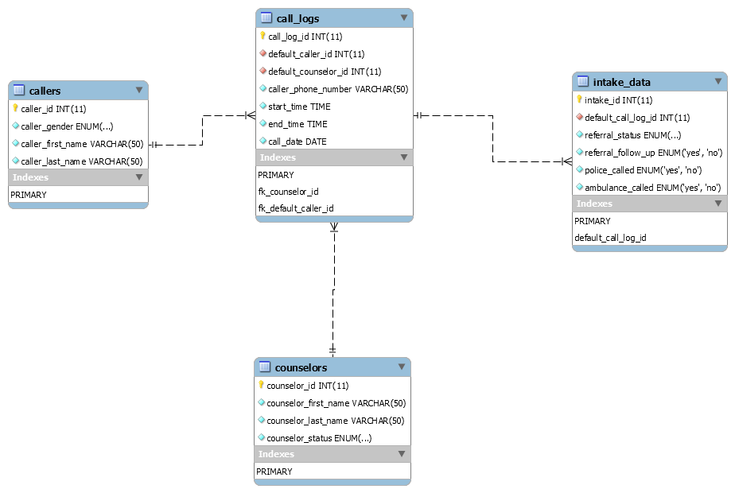

# Community Call Center
* Objective: 
  * Cover general use cases for a Crisis Center to aid in the tracking of their employees, volunteers, and callers

* Developed an Entity-Relationship Diagram identifying primary and foreign keys, indices, table relationships, and columns along with data type values

* Developed MySQL script to build the database and query for information relevant to the operations of a Community Crisis Call Center including:
  1) A query returning results of average call lengths per counselor on a given day
  2) A query returning results for the number of calls on a particular day of the week within a defined time period
  3) A query returning results for the number of calls of a defined status (e.g. referred, ambulance-called....) within a defined time period (i.e. given month)

* Outlined functional dependencies for the database

* Developed a Database Dictionary outlining the utility, data types, and purpose behind the database's structure

_Table Design_

